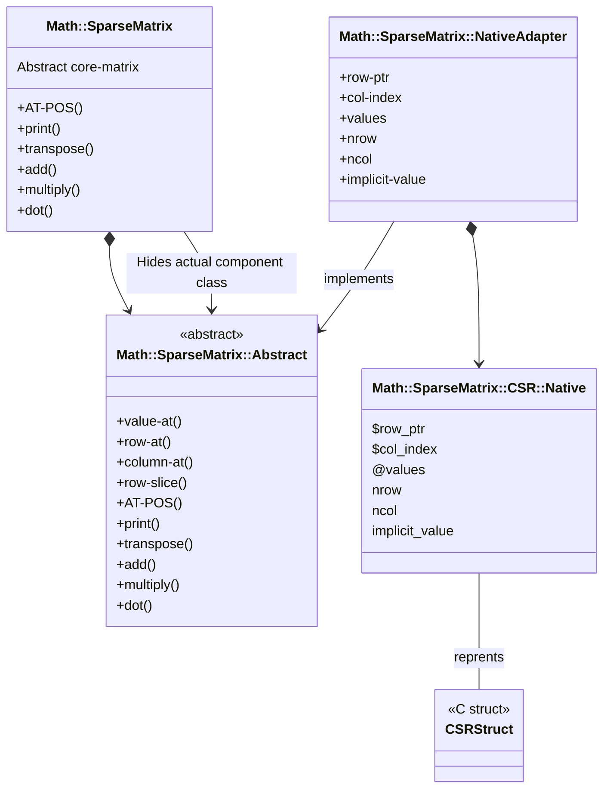

# Math::SparseMatrix::Native

[](https://github.com/antononcube/Raku-Math-SparseMatrix-Native/actions)
[](https://github.com/antononcube/Raku-Math-SparseMatrix-Native/actions)

[](https://opensource.org/licenses/Artistic-2.0)

Raku package with sparse matrix algebra functions implemented in C.

**Remark:** Currently, Apple's Accelerate library is _not_ used (if it is available.)
There are several reasons for this: 
(i) lack of appropriate documentation to sparse linear algebra in C,
(i) using dense matrices for sparse matrix computations with its older LAPACK interface libraries.

------

## Usage examples

Make two random -- relatively large -- sparse matrices:

```perl6
use Math::SparseMatrix::Native;
use Math::SparseMatrix::Native::Utilities;

my $nrow = 1000;
my $ncol = 10_000;
my $density = 0.005;
my $nnz = ($nrow * $ncol * $density).Int;
my $seed = 3432;

my $matrix1 = Math::SparseMatrix::Native::CSRStruct.new.random(:$nrow, :$ncol, :$nnz, :$seed);
my $matrix2 = Math::SparseMatrix::Native::CSRStruct.new.random(nrow => $ncol, ncol => $nrow, :$nnz, :$seed);

say (:$matrix1);
say (:$matrix2);
```
```
# matrix1 => Math::SparseMatrix::Native::CSRStruct(:specified-elements(50000), :dimensions((1000, 10000)), :density(0.005))
# matrix2 => Math::SparseMatrix::Native::CSRStruct(:specified-elements(50000), :dimensions((10000, 1000)), :density(0.005))
```

**Remark:** Compare the dimensions, densities, and the number of "specified elements" in the gists. 

Here are 100 dot-products of those matrices (with timings):

```perl6
my $tstart=now;
my $n = 100;
for ^$n {
    $matrix1.dot($matrix2)
}
my $tend=now;
say "Total time : {$tend - $tstart}";
say "Mean time  : {($tend - $tstart)/$n}"
```
```
# Total time : 0.1960611
# Mean time  : 0.0019606109999999997
```

------

## Design

The primary motivation for implementing this package is need to have _fast_ sparse matrix computations.

- The pure-Raku implemented sparse matrix algorithms in 
["Math::SparseMatrix"](https://raku.land/zef:antononcube/Math::SparseMatrix), [AAp1],
are too slow. 

- Same algorithms implemented in C (in this package) are ≈100 times faster.  

The `NativeCall` class `Math::SparseMatrix::Native::CSRStruct` has Compressed Sparse Row (CSR) format sparse matrix operations.
The [Adapter pattern](https://en.wikipedia.org/wiki/Adapter_pattern) is used to include `Math::SparseMatrix::Native::CSRStruct`
into the `Math::SparseMatrix` hierarchy:



------

## TODO

- [ ] TODO Core functionalities
    - [X] DONE C-struct representation: data and methods
    - [X] DONE `transpose`
    - [X] DONE `dot-pattern`
    - [X] DONE `dot` matrix x dense vector
    - [X] DONE `dot` (and `dot-numeric`) matrix x matrix
    - [X] DONE `add` with a scalar
    - [X] DONE `add` with another matrix
    - [X] DONE `multiply` with a scalar
    - [X] DONE `multiply` with another matrix
- [X] DONE Refactoring
  - Consistent use of `unsigned int` or `int` for `row_ptr` and `col_index`. 
- [ ] TODO Adaptation to "Math::SparseMatrix"
    - This package was made in order to have faster computation with "Math::SparseMatrix".
    - But it can be self-contained and independent from "Math::SparseMatrix".
    - Hence, we make an adapter class in "Math::SparseMatrix".
- [ ] TODO Unit tests
    - [ ] TODO Creation (and destruction)
    - [X] DONE Element-wise operations
    - [X] DONE Dot product

------

## References

[AAp1] Anton Antonov,
[Math::SparseMatrix Raku package](https://github.com/antononcube/Raku-Math-SparseMatrix),
(2024),
[GitHub/antononcube](https://github.com/antononcube).

